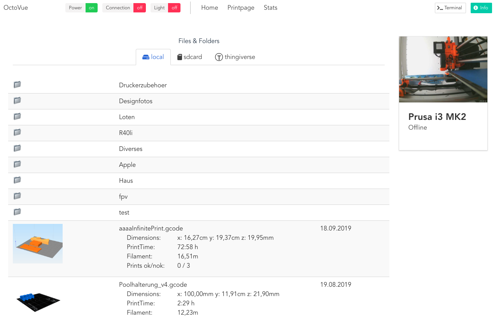
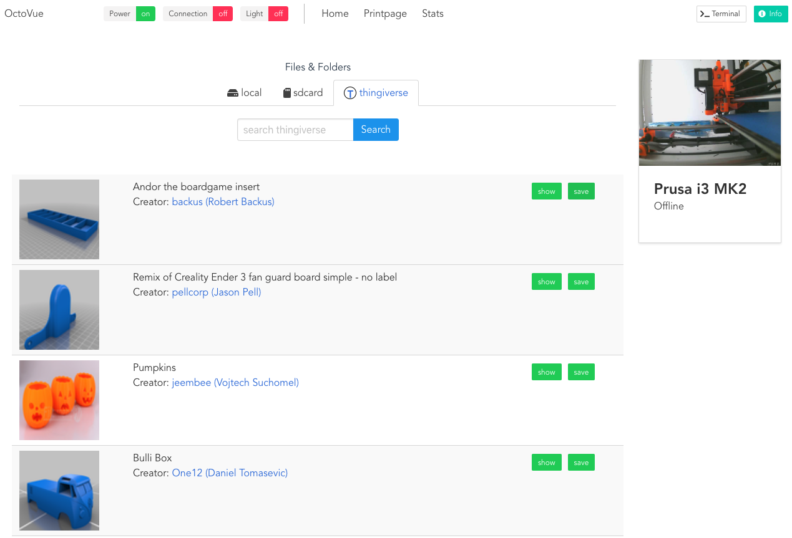
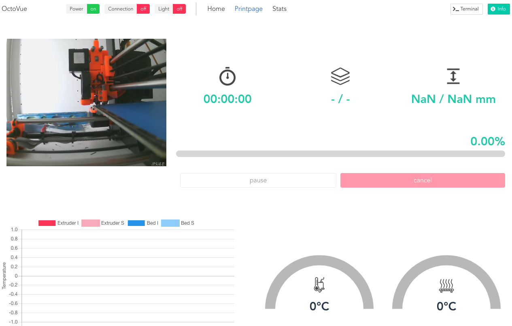
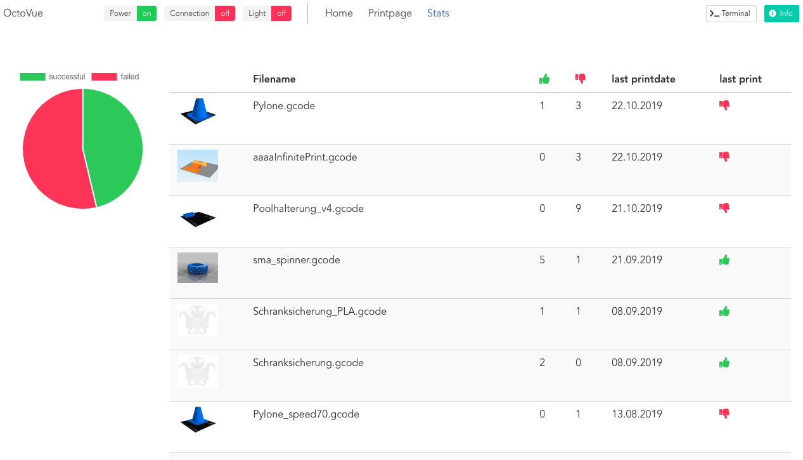

# OctoVue

An alternative UI for octoprint based on vue.js and bulma css framework


## Functionality
 - of course upload and print gcodes :-)
 - looking more modern than octoprint :-)
 - preview gcode files, if image available (place image named the same like gcode file into same directory. For example you have Vase.gcode, put preview image/photo named "Vase.png" in same directory)
 - Search thingiverse inside OctoVue for models and download them
 - nice printpage with graphs and gauges for temperatures (for now up to 7 hotends + heated bed and heated enclosure supported)
 - statistics page with overview of printed files (successful / failed)
 - control printer power in case you power your printer with a Sonoff POW (with tasmota fw) from OctoVue (maybe installation of <a href="https://github.com/Rob--W/cors-anywhere" target="_blank">CORS anywhere proxy</a> on a computer in your network needed)
 - control enclosure light (external control unit like nodeMCU) from OctoVue (maybe installation of <a href="https://github.com/Rob--W/cors-anywhere" target="_blank">CORS anywhere proxy</a> on a computer in your network needed)


## prerequisites

* install & configure octoprint
  * octoprint settings:
  	* enable cors
  	* enable api

* octoprint plugins needed:
  * OctoPrint-DisplayLayerProgress (https://github.com/OllisGit/OctoPrint-DisplayLayerProgress)


### Install NodeJS

Go to node.js download page and check right click on the version of ARM that you need and choose Copy Link address.

```mkdir ~/tmp && cd ~/tmp```

```wget https://nodejs.org/dist/v8.9.3/node-v8.9.3-linux-armv7l.tar.xz```

```tar -xvf node-v8.9.3-linux-armv7l.tar.xz```

```cd node-v8.9.3-linux-armv7l```

```sudo cp -R * /usr/local/```


check if everything went well:

```node --version && npm --version```

```cd ~ && rm -rf ~/tmp```


## Installation
```cd ~/```

```git clone https://github.com/shodushi/octovue.git```

```cd octovue```

```npm install```

```npm run build```


## Run

```
a) sudo npm install -g serve
   nohup serve -s -l 8001 dist &

   browse to http://YOUR-RASPBERRY-IP:8001

          OR

b) copy "dist" directory into any webserver document root in your network

cp -r ~/octovue/dist/* /var/www/

browse to http://YOUR-WEBSERVER-IP
```

## Configuration

Enter all infos in initial config screen and save.

Hint:

Configuration will be lost, when accessed from another browser or browser cache is cleared.

To make your configuration persistent, click "export config" button
and upload "octovue_config.txt" into "dist" folder.


## Preview


<hr />



<hr />



<hr />


